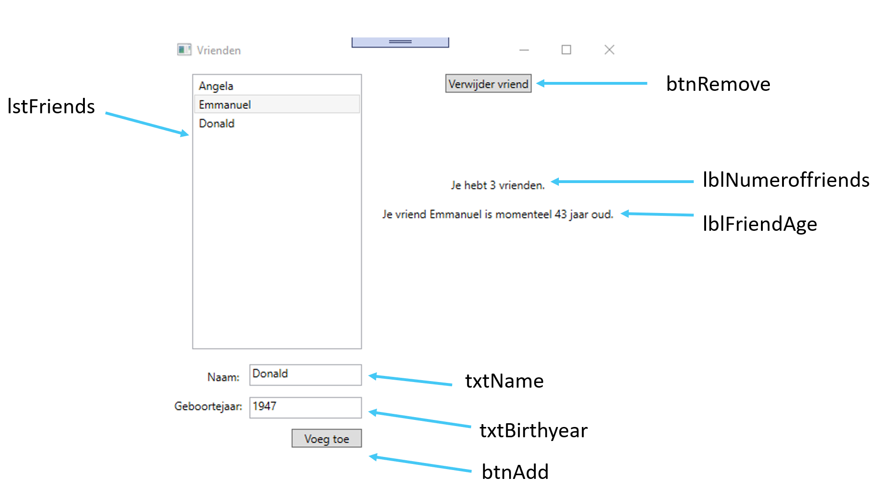

# Oefening Hoofdstuk 6: Vriendenlijst

## Basisfunctionaliteit

Schrijf een WPF-applicatie om de leeftijd van je vrienden bij te houden. Maak hiervoor gebruik van een dictionary.

De WPF applicatie bevat de volgende componenten.

Bij het opstarten van de applicatie is de listbox lstFriends en het label lblFriendAge leeg.

Met btnAdd kun je een vriend toevoegen aan lstFriends. Als je dan een vriend selecteert in lstFriends verschijnt de gepaste tekst in lblFriendAge. Je mag er voor je initiële versie van uitgaan dat de leeftijd van de vriend gelijk is aan (2020 - geboortejaar).

Wanneer er minstens 1 vriend staat in lstFriends is de knop btnRemove klikbaar, wanneer lstFriends leeg is, is btnRemove niet klikbaar.

Door op btnRemove te klikken, verwijder je de huidige geselecteerde vriend.

## Extra's

Zorg ervoor dat je geen twee vrienden met dezelfde naam kunt toevoegen. Hou er rekening mee dat als je een vriend verwijdert, je hem wel opniew moet kunnen toevoegen.

Zorg ervoor dat wanneer je maar 1 vriend hebt, de tekst in lblNumberofFriends "Je hebt 1 vriend" wordt in plaats van "Je hebt 1 vrienden".

Maak de berekening van de leeftijd "slimmer" door het huidige jaar in je code op te vragen (zoek eens naar hoe je DateTime kunt gebruiken in c#). Probeer vervolgens ook txtBirthyear the vervangen door een DatePicker control.